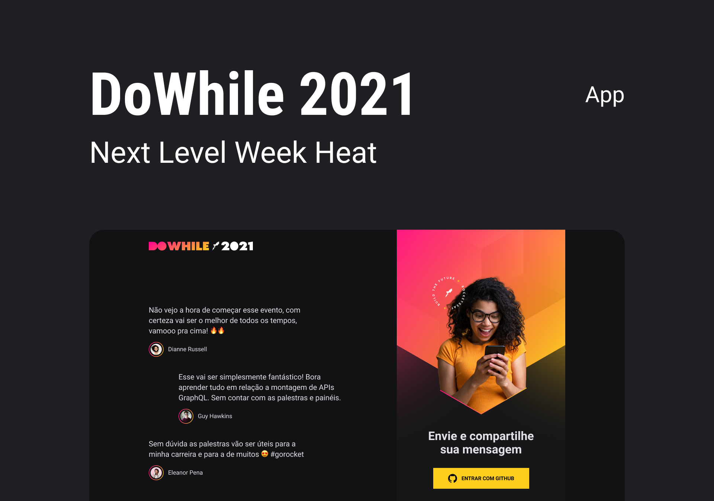

      

<h1 align="center">[NLW Heat] Mission: Impulse</h1>

- ✅ Abertura – O Início da Missão
- ✅ Stage 1 - Backend
- ✅ Stage 2 - Front-End Web 
- ✅ Stage 3 - Front-End Mobile
- ✅ Stage 4 - Microserviço 
- ✅ Stage 5 – O Próximo Nível
---

<h2 align="center">Tópicos 📋</h2>

   

   
   - [Sobre 📖](#sobre-)
   - [Layout 🎨](#layout-)
   - [Tecnologias 🛠️](#Tecnologias-)
   - [Arquivos no Notion 📋](#arquivo-no-notion-)
   - [Licença 📝](#licença-)

   

---

<h2 align="center">Sobre 📖</h2>

   Esse projeto foi desenvolvido na Next Level Week Heat, em uma semana intensa de estudos, acompanhado de um projeto desenvolvido pela Rocketseat do dia 18 ao dia 24 de Outubro. 
   Essa aplicação é voltada para o evento Do While 2021, contendo um mural de depoimentos/mensagens de expectativas sobre o evento, que inclusive será utilizado no evento.  

 
---

<h2 align="center">Layout 🎨</h2>

   

      
   

   

      O Layout desenvolvido por <a href="https://instagram.com/tiagoluchtenberg">Tiago Luchtenberg</a>, para acessar no Figma:
   
   - <a href="https://www.figma.com/community/file/1031699316177416916">Missão Impulse</a> 🚀
   

---   

<h2 align="center">Tecnologias 🛠️</h2>

   

- [Node.js](https://nodejs.org/en/)
- [ReactJS](https://reactjs.org/)
- [React Native](https://reactnative.dev/)
- [Elixir](https://elixir-lang.org/)

   

---

<h2 align="center">Arquivo no Notion 📋</h2>

- [Missão Impulse](https://efficient-sloth-d85.notion.site/Impulse-240cb588fb8d4089917c7a6cef0008b3) 🚀

---

<h2 align="center">Licença 📝</h2>

   Este repositório está sob licença MIT. Você pode ver o arquivo <a href="https://github.com/ErickSilva2605/rocketseat_nlw_heat/blob/main/LICENSE">LICENSE</a> para mais detalhes.

 

   ---

   >Esse projeto foi desenvolvido por Erick Augusto, com os instrutores da **[Rocketseat](https://rocketseat.com.br/)**, na #NextLevelWeekHeat. 

---

   

